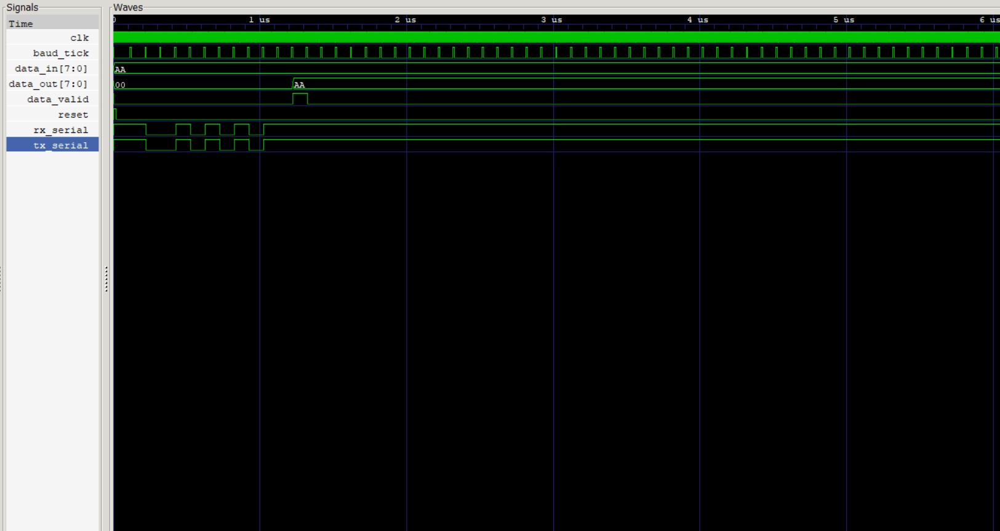

# UART Transmitter and Receiver in Verilog HDL

## Overview

This project implements a Universal Asynchronous Receiver Transmitter (UART) in Verilog HDL. The design consists of a UART Transmitter (TX), UART Receiver (RX), and Baud Rate Generator. A loopback testbench is used to verify successful serial communication between the transmitter and receiver.

## Features

* FSM-based UART Transmitter
* FSM-based UART Receiver
* Baud Rate Generator
* 8-bit UART Communication
* Start and Stop Bit Framing
* LSB-First Data Transmission
* Loopback Verification through Simulation
* GTKWave Waveform Analysis

## Project Structure

```text
uart-verilog/
│
├── rtl/
│   ├── uart_tx.v
│   ├── uart_rx.v
│   └── baud_gen.v
│
├── tb/
│   └── uart_tb.v
│
├── screenshots/
│   └── uart_waveform.png
│
├── README.md
└── .gitignore
```

## UART Frame Format

```text
| Start | Data[7:0] | Stop |
|   0   | LSB First |  1   |
```

Example transmission:

```text
Input Byte : 0xAA
Binary     : 10101010

Serial Data:
0 | 0 1 0 1 0 1 0 1 | 1
```

## Module Description

### Baud Rate Generator

Generates periodic baud ticks used to synchronize UART transmission and reception.

### UART Transmitter

Finite State Machine:

```text
IDLE → START → DATA → STOP → IDLE
```

Responsibilities:

* Latches input data
* Generates UART frame
* Transmits data serially (LSB first)

### UART Receiver

Finite State Machine:

```text
IDLE → DATA → STOP → IDLE
```

Responsibilities:

* Detects start bit
* Receives serial data
* Reconstructs the transmitted byte
* Generates data valid signal

## Simulation Results

Loopback connection:

```verilog
assign rx_serial = tx_serial;
```

Test Data:

```verilog
data_in = 8'b10101010;
```

Result:

```text
Transmitted Data : 0xAA
Received Data    : 0xAA
Status           : PASS
```

### Waveform



The waveform confirms successful UART transmission and reception through loopback testing.

## Running the Simulation

Compile:

```bash
iverilog -o tb_uart.vvp tb/uart_tb.v rtl/*.v
```

Run:

```bash
vvp tb_uart.vvp
```

Open Waveform:

```bash
gtkwave uart.vcd
```

## Concepts Demonstrated

* Verilog HDL
* RTL Design
* Finite State Machines (FSMs)
* Serial Communication Protocols
* Testbench Development
* Digital System Verification

## Future Improvements

* Parity Bit Support
* Configurable Baud Rate
* FIFO Buffers
* Framing Error Detection
* Oversampling-Based Receiver

## Author

**Lokesh Kumar**

Developed as a digital design project to strengthen Verilog HDL, FSM design, and communication protocol implementation skills.
